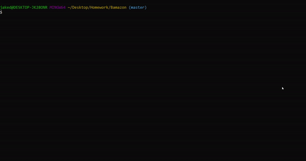
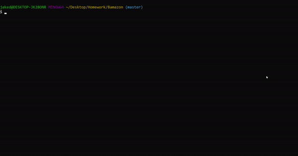

# Bamazon

Bamazon is a mock storefront that uses [MySQL](https://www.mysql.com/) to store and modify inventory of products across various departments. There are ten default products already entered in bamazon.sql that can be modified or even removed if desired. Users can either use bamazonCustomer.js, bamazonManager.js, or bamazonSupervisor.js in order to modify or check the database. If bamazonCustomer.js is selected the user will be able to purchase products from the displayed table (inventory permitting) and then the total cost of the purchase will be displayed along with and updated table. If bamazonManager.js is selected the user will be able to view all products within the database table, view only products with a low inventory, add inventory to existing products, or create a new product. And lastly, if bamazonSupervisor.js is seleceted the user will be able to add new departments and view the total sales of each department along with the total profits for each one as well. Every time the user is asked for input their response is validated using [Inquirer](https://www.npmjs.com/package/inquirer)'s validate function in order to avoid database errors, such as inputing a non-number or an empty response. The app in its entirety runs in the console/terminal.

# Demo (Customer)


# Demo (Manager)


# Demo (Supervisor)


# Link to Github
[Bamazon](https://github.com/JakeDudum/Bamazon)

# How to Install (MUST HAVE GITHUB)

1. Open gitbash/terminal/console and navigate to where you would like to copy the program down to and enter the following:
```gitbash
git clone https://github.com/JakeDudum/Bamazon.git
```
2. Navigate into the newly created repo location with the following:
```gitbash
cd Bamazon
```
3. Next enter the following to install required npm packages:
```gitbash
npm install
```
4. Enter the one of the following commands to launch the respective program:
```gitbash
node bamazonCustomer.js
node bamazonManager.js
node bamazonSupervisor.js
```
5. Follow the instructions displayed by the program and select desired functionality.
5. Enjoy!

# Built With
- [Javascript](https://developer.mozilla.org/en-US/docs/Web/JavaScript)
- [Node](https://nodejs.org/en/about/)
- [NPM](https://docs.npmjs.com/about-npm/)
- [MySQL](https://www.mysql.com/)

# NPM's Used
- [Inquirer](https://www.npmjs.com/package/inquirer)
- [MySQL](https://www.npmjs.com/package/mysql)
- [CLI-Table](https://www.npmjs.com/package/cli-table)

# Versioning
- [Github](https://github.com/)

# Databases
- [MySQL](https://www.mysql.com/)

# Authors
### Jake Dudum